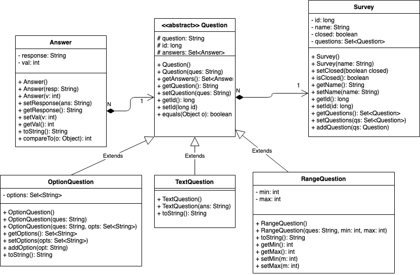

# SimpleSurvey

Surveyor can create a survey with a list of Questions. Questions can be open-ended (text), asking for a number within a range, or asking to choose among many options. Users fill out a survey that is a form generated based on the type of questions in the survey. Surveyor can close the survey whenever they want (thus not letting in new users to fill out the survey), and at that point a survey result is generated, compiling the answers: for open-ended questions, the answers are just listed as-is, for number questions a histogram of the answers is generated, for choice questions a pie chart is generated

## Design

### UML



### ER


## Client app (React)

The client side technology used for this application is [React](https://reactjs.org/) and is hosted in the `./client` directory. The project was scaffolded with [create-react-app](https://github.com/facebook/create-react-app). To run the client dev-server, you will need [yarn](https://yarnpkg.com/) and node v10 installed. Refer to these [additional docs](./client/README.md) for more details.

### Starting your react application

```
$ cd client
$ yarn install
$ yarn start
```

### Production deployment

Run the following script to prepare the React application for production deployment. This will run a production build of the React app and copy the static assets to the public folder in the Java application. This must be run before deploying the Java application to production.

```
$ cd client
$ yarn install
$ yarn build
```
